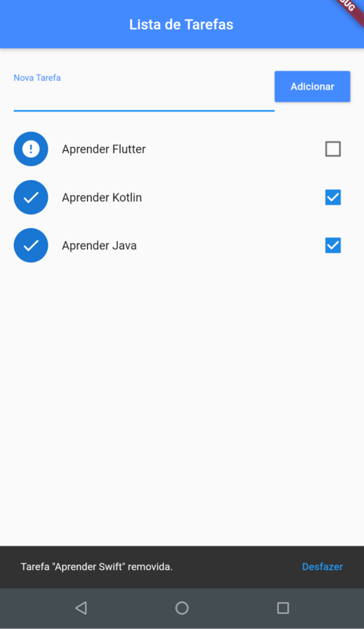

# Flutter - Lista de Tarefas

## Aplicativo para elaboração de lista de tarefas

Esse é o terceiro app desenvolvido no curso **Criação de Apps Android e iOS com Flutter**. Com ele é possível elaborar uma lista de tarefas a serem feitas, com a possibilidade de marca-las como concluídas.

Alguns detalhes utilizados no projeto:
* Armazenamento de dados locais
* ListView
* SnackBar
* Refresh Indicator

### Screenshots

